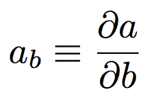
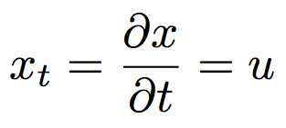
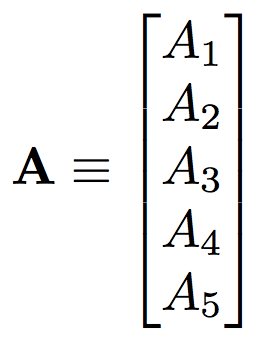
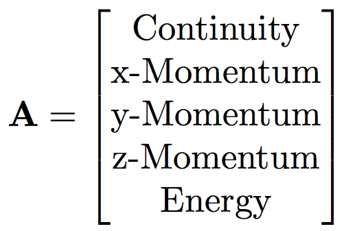
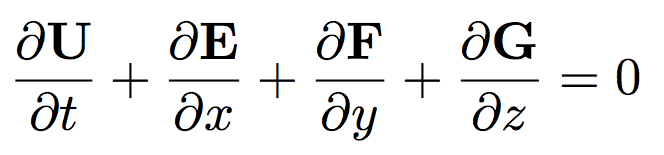

!SLIDE center
# Subscripts

.notes For example

!SLIDE center
# For Example: Velocity

.notes bold -> vector

!SLIDE center
# Bold: Vector

!SLIDE center
# The 5 Elements

.notes navier-stokes equations

!SLIDE center
# Navier-Stokes Equations*

.notes TRANSFORMATION - NOT ALWAYS WANT CUBES - cylindrical
