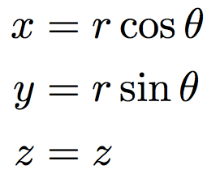
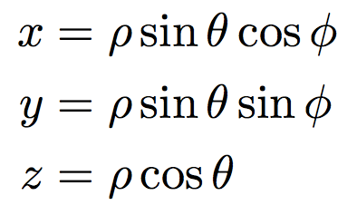
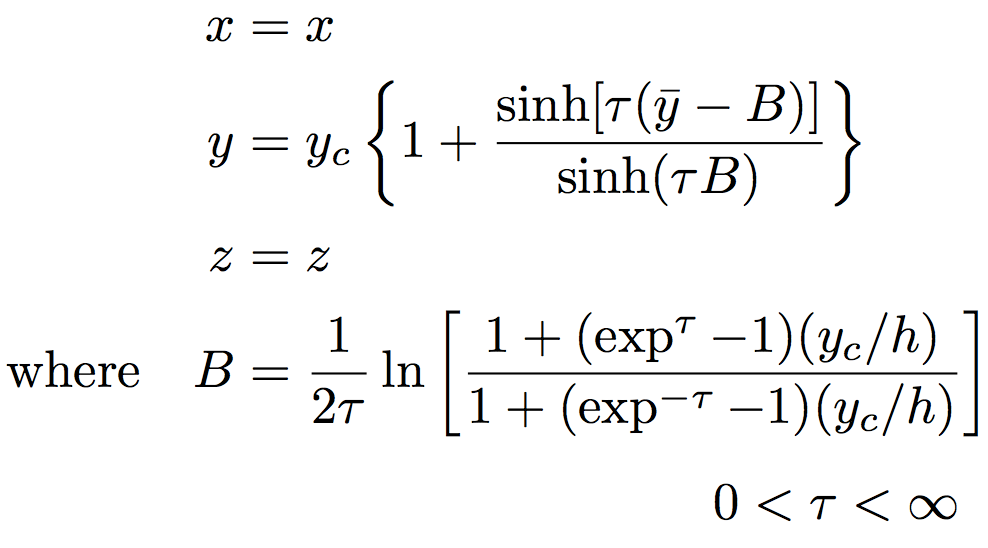
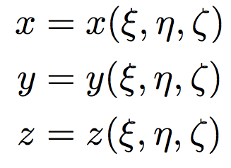
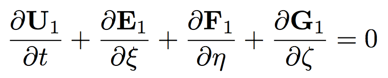
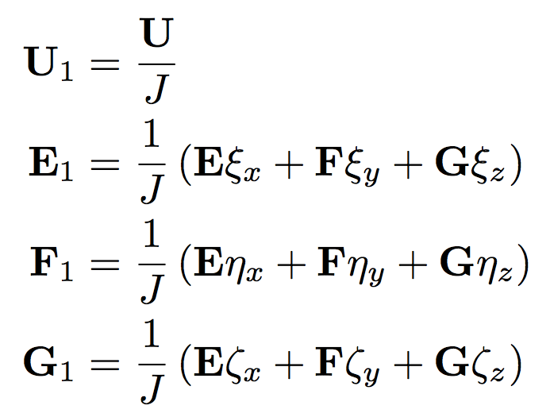
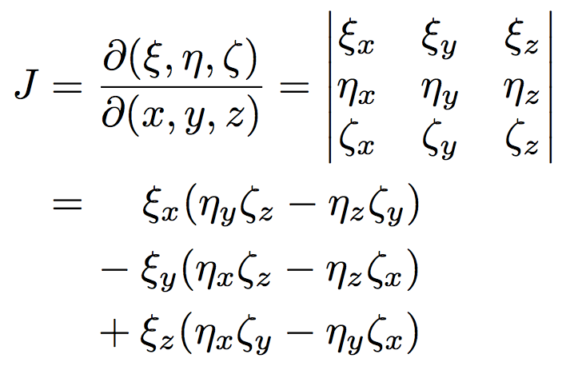
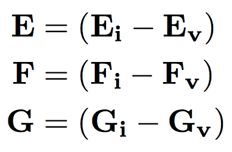
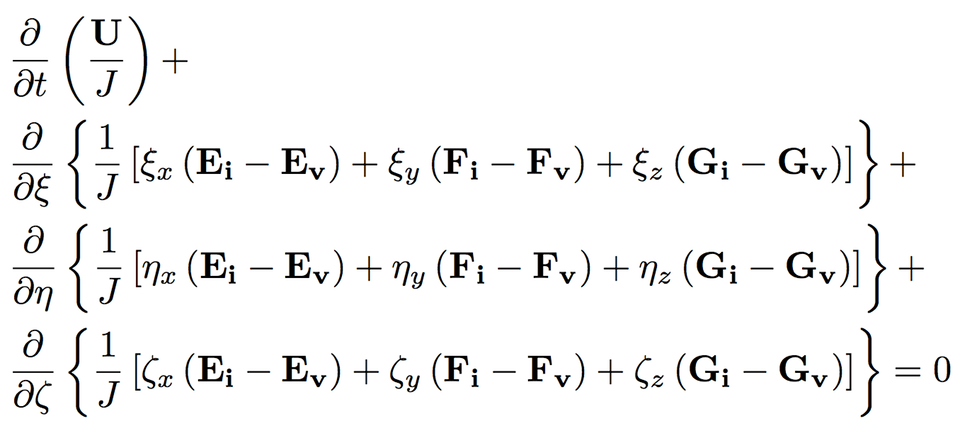

!SLIDE center
# Cylindrical Transformation

.notes spherical

!SLIDE center
# Spherical Transformation

.notes pinched mesh

!SLIDE center
# Pinched Mesh

.notes general transformation

!SLIDE center
# General Transformation

.notes navier-stokes transformed

!SLIDE center
# Transformed Navier-Stokes

.notes Transformed vectors

!SLIDE center
# Transformed Vectors

.notes Jacobian

!SLIDE center
# Jacobian

.notes E F G, split - inviscid & viscous

!SLIDE center
# Inviscid & Viscous

.notes Expand the equation

!SLIDE center
# Glorious!

.notes look at conserved
