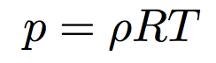

!SLIDE center
# "Conserved"

.notes rho - boyles law

!SLIDE center
# Boyle's Law
<!-- ' syntax highlighting hack -->

.notes or van der waals

!SLIDE center
# Van der Waals

.notes Et - thermal kinetic

!SLIDE center
# Thermal & Kinetic Energy

.notes flux to the right, start with inviscid

!SLIDE center
# Inviscid Flux (right)

!SLIDE center
# Inviscid Flux (up)

!SLIDE center
# Inviscid Flux (out)

.notes viscous flux

!SLIDE center
# Viscous Flux

!SLIDE center
# Viscous Flux Part Deux

!SLIDE center
# Viscous Flux Returns:
# The Fluxinating

.notes axial, compressive stress

!SLIDE center
# Axial (Compressive) Stress

!SLIDE center
# More Axial Stress

!SLIDE center
# Axial Stress Yet Again

.notes shear stress

!SLIDE center
# Shear Stress

.notes finally, heat

!SLIDE center
# HEAT

.notes what are we left with? the variables
