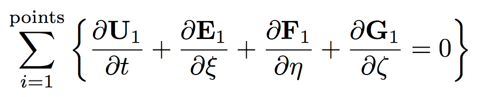
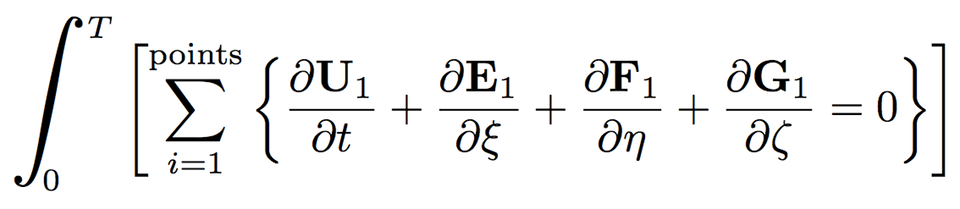
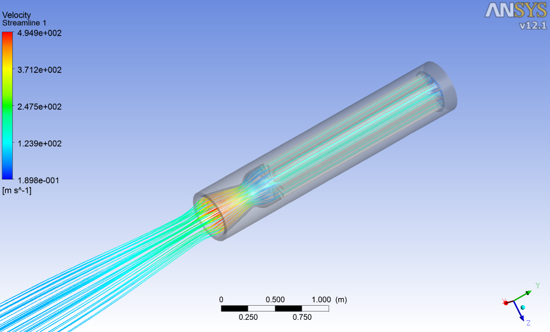

!SLIDE center
# The Variables
## *u, v, w, T, p*

.notes plus species concentration

!SLIDE center
# The Variables++
## *u, v, w, T, p* (and species concentrations)

.notes sum over points

!SLIDE center
# Sum Over Points

.notes integrate over time

!SLIDE center
# Integrate Over Time

.notes Boom. Rocket.

!SLIDE center
## Boom. Rocket.

###### http://cstart.org/forum/rocket-body-discussion/preliminary-ohkla-design/page-2/

.notes so... bwoken
