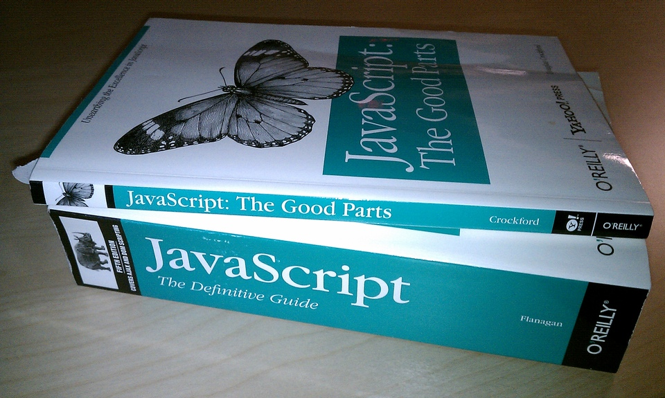
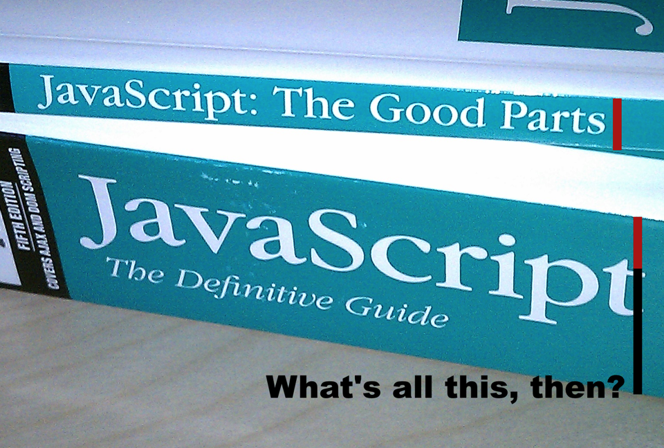

!SLIDE

.notes javascript, the good parts

!SLIDE

CC BY 2.0: http://www.flickr.com/photos/nathansmith/4704268314/

.notes zoom in

!SLIDE

CC BY 2.0: http://www.flickr.com/photos/nathansmith/4704268314/

.notes What does coffeescript look like?

!SLIDE compare
## Coffeescript
    @@@ coffeescript
    foo = 1

## Javascript
    @@@ javascript
    var foo;
    foo = 1;
.notes next up, I can define some functions

!SLIDE compare
## Coffeescript
    @@@ coffeescript
    square = (x) -> x * x
    math =
      root: Math.sqrt
      cube: (x) -> x * square x
      square: square

## Javascript
    @@@ javascript
    var math, square;

    square = function(x) {
      return x * x;
    };

    math = {
      root: Math.sqrt,
      square: square,
      cube: function(x) {
        return x * square(x);
      }
    };
.notes we can even do splats, or va_lists

!SLIDE compare
## Coffeescript
    @@@ coffeescript
    race = (winner, runners...) ->
      print winner, runners

## Javascript
    @@@ javascript
    var race,
      __slice = [].slice;

    race = function() {
      var runners, winner;
      winner = arguments[0];
      if (2 <= arguments.length)
        runners = __slice.
          call(arguments, 1);
      else
        runners = [];
      return print(winner, runners);
    };
.notes complex list comprehensions

!SLIDE compare
## Coffeescript
    @@@ coffeescript
    foods = [
      'nutella'
      'chocolate'
    ]
    eat = (f) -> om.nom f

    eat food for food in foods \
      when food isnt 'chocolate'

## Javascript
    @@@ javascript
    // NOPE NOPE NOPE
.notes soak up nulls and undefineds

!SLIDE compare
## Coffeescript
    @@@ coffeescript
    quux = foo.bar?().baz?.qux?

## Javascript
    @@@ javascript
    // IT BURNSES
.notes classes with inheritence

!SLIDE compare
## Coffeescript
    @@@ coffeescript
    class NavScreen extends Screen

      backButton: ->
        @navigationBar().leftButton()

      back: ->
        @backButton().tap()

## Javascript

http://imgur.com/SWipd

.notes Why CoffeeScript?

!SLIDE bullets incremental
# Why CoffeeScript?
* The most important parser for any code
* is another human being,
* whether a teammate or your future self.
* — me, right now (inspired by others, of course)

.notes What would it look like to use CoffeeScript with UI Automation?

!SLIDE
    @@@ coffeescript
    Favorites = new class extends Screen

      table: ->
        MyApp.tableWithName 'Favorites'

      favoriteNamed: (name) ->
        @table().cells()[name]

      tapFavoriteNamed: (name) ->
        @favoriteNamed(name).tap()

      assertFavoriteNamed: (name) ->
        assertTrue \
          @favoriteNamed(name).isVisible()

.notes and our tests look like this

!SLIDE
    @@@ coffeescript
    test 'favoriting', (app, target) ->

      Policies.markAsFavorite('80/10')
      Policies.flipToFavorites()
      Favorites.assertFavoriteNamed('80/10')

.notes last piece of the puzzle: rake
